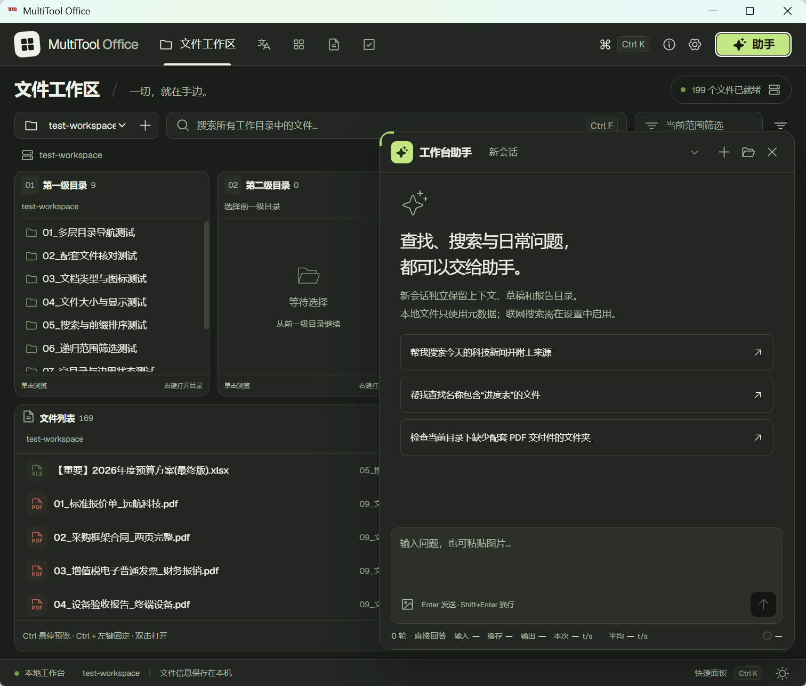
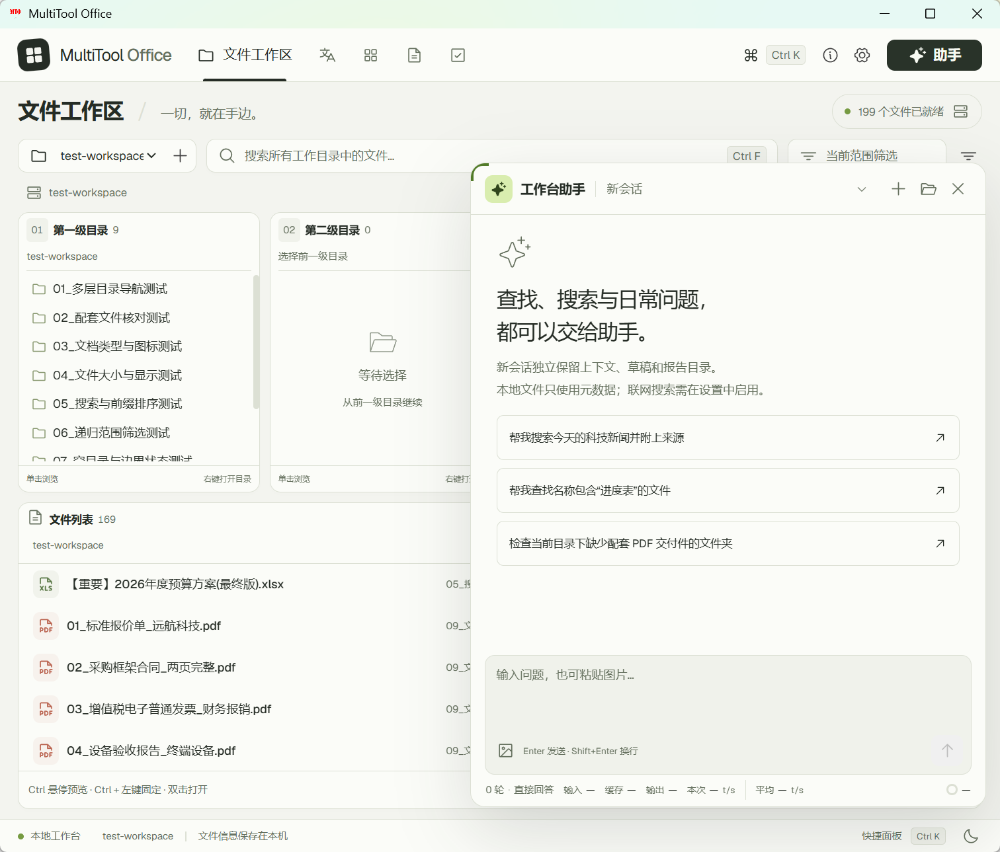
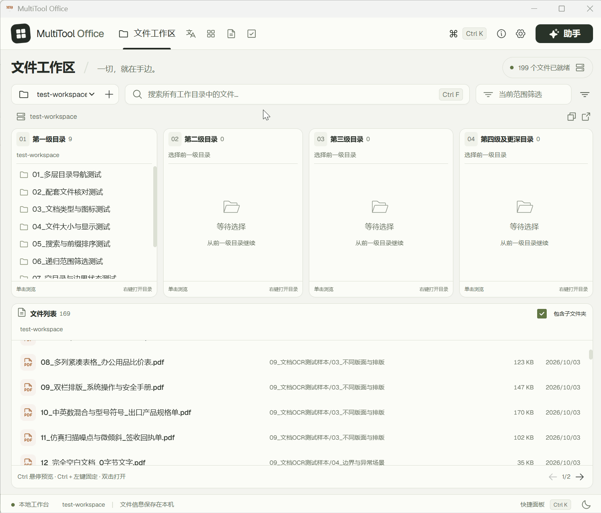
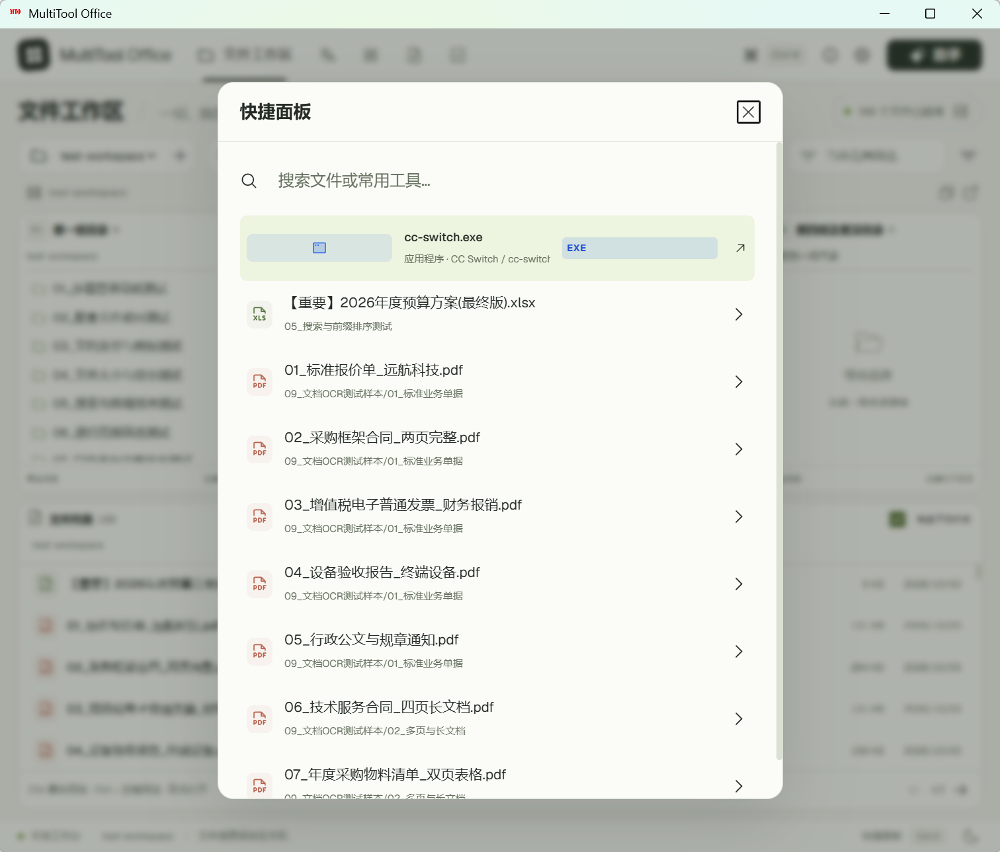
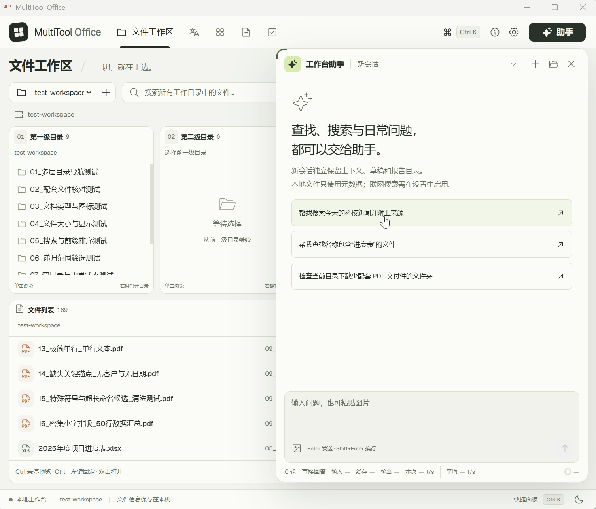
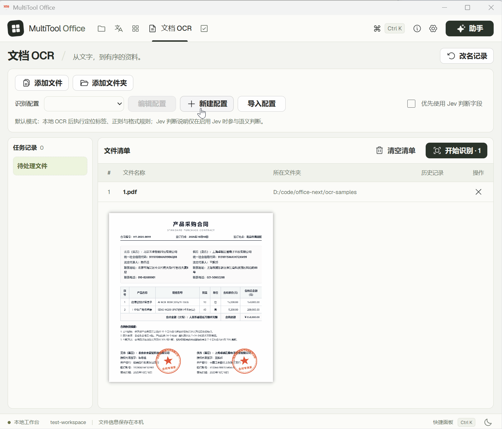
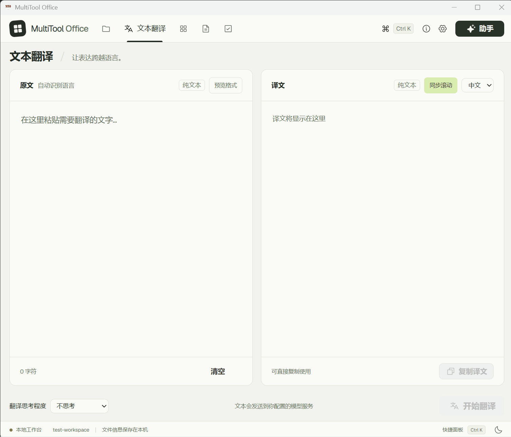
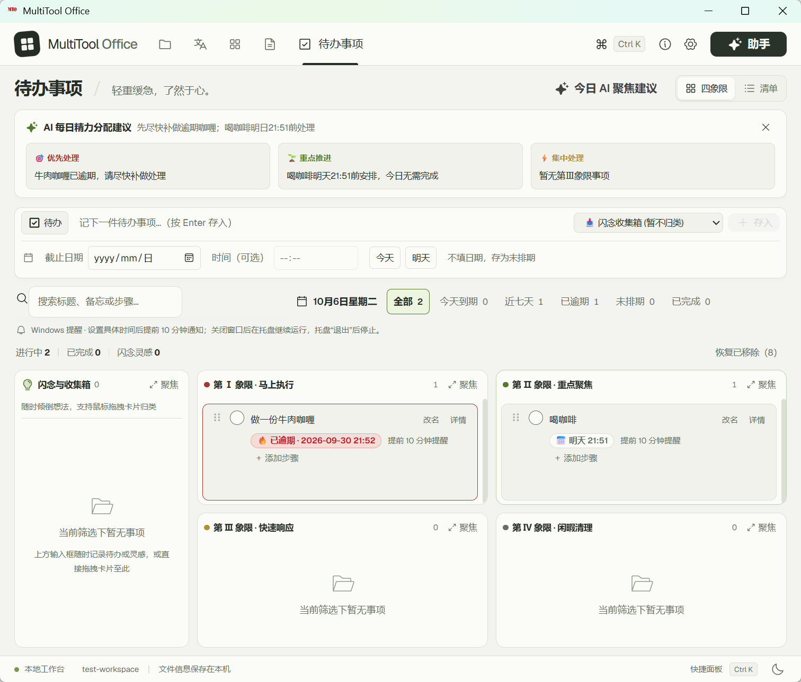

# 🏢 MultiTool Office Next

> 面向 Windows 的文件管理与办公工作台，集成本地检索、AI 助手、OCR、翻译和待办。

把多层目录浏览、文件搜索和日常办公操作集中到一个窗口：查找资料、核对配套文件、识别合同字段、批量命名，或随时唤出常用工具。

AI 助手可配置 DeepSeek 等 OpenAI 兼容模型服务；联网搜索使用 Tavily，Jev 辅助判定使用 TypeSafe 官方接口。相关联网功能需自行配置服务密钥。

| 深色模式 | 浅色模式 |
| :---: | :---: |
|  |  |

## 功能与演示

### 文件浏览与检索

多列级联目录配合面包屑导航，方便在深层文件夹之间切换；支持本地元数据索引、文件格式和修改时间筛选，以及搜索结果定位。

按住 `Ctrl` 悬停文件可临时预览，`Ctrl + 左键` 可固定预览。支持图片、PDF、文本及文档、表格内容；预览在本机读取，不上传，也不进入助手上下文。

### 快捷访问与常用工具

将常用程序、文档和模板分组保存，在快捷面板中搜索并打开。窗口内使用 `Ctrl + K`，其他应用中使用 `Ctrl + Shift + Space` 唤回工作台。

### AI 办公助手

通过自然语言检索资料、核对缺失配套件、生成带定位链接的 HTML 报告，或调用 Tavily 查询公开资讯。例如：“列出项目目录中缺少配套 PDF 的文件夹。”

支持查看模型思考和工具调用，以及用 SOUL.md、AGENTS.md、USER.md 自定义角色与回答偏好。图片问答需配置支持视觉的模型，每次最多 4 张、单张不超过 5 MB。

### OCR 识别与批量命名

使用 RapidOCR 在本机识别 PDF 和图片单据，通过定位标签、正则、画框与格式规则提取公司名称、合同编号、日期、产品等字段。支持 AI 生成或微调配置，也可按需启用 Jev 辅助判断。

AI 配置生成只接收需求和配置定义，未读取样本文档；微调时请写明字段名称，核对草稿并保存后生效。识别结果可查看来源行、诊断与判定记录，再人工修正、导出或批量命名。

批量改名前先预览并确认；支持撤销，撤销时会检查文件是否已修改及原名称是否被占用。

### 即时翻译

支持纯文本、Markdown 和网页格式的双栏翻译与段落对应。输入或粘贴内容后主动提交，预览不会自动加载图片网址；清空内容会取消当前翻译任务。

### 待办与提醒

在四象限和清单视图中管理待办与灵感，支持日期、时间、多级步骤，以及今天到期、近七天、逾期等筛选。误删的事项可恢复。

设置具体日期和时间的未完成待办支持到期前 10 分钟提醒。提醒需保持应用运行，可关闭主窗口并驻留托盘；从托盘退出后停止提醒，重复启动会唤回已有实例。

## 快速上手

运行提供的 `MultiTool Office Next_<version>_x64-setup.exe` 安装包，按向导完成安装。应用默认安装到当前 Windows 用户，升级保留应用数据，需要 Microsoft Edge WebView2 运行时。

1. **添加工作目录**：在左上角目录菜单或“设置”中选择资料文件夹，应用会建立本地文件索引。
2. **添加常用工具**：进入“设置 → 常用工具”，保存常用程序、文档或模板，并按需分组。
3. **连接 AI 服务（可选）**：在“模型参数”中填写 OpenAI 兼容服务地址和模型 ID，保存密钥及模型参数。联网搜索和 Jev 的密钥与开关在“联网与评分”中配置。

设置中的“导入导出”可备份或迁移目录、常用工具、外观、模型参数与联网开关。导入需校验并确认；导出不包含 API 密钥、助理角色文件、报告目录和业务记录。

## 常用操作

| 操作 | 作用 |
| :--- | :--- |
| `Ctrl + F` | 文件工作区聚焦全局搜索；待办页面聚焦待办搜索 |
| `Ctrl + 悬停` | 临时预览文件 |
| `Ctrl + 左键 / Ctrl + Enter` | 固定文件预览 |
| `Ctrl + K` | 打开或关闭窗口内的快捷面板 |
| `Ctrl + Shift + Space` | 从其他应用唤回工作台并展开快捷面板 |
| `Esc` | 关闭当前弹窗或预览，退出四象限最大化 |
| `Enter / Shift + Enter` | 助手输入框发送任务 / 换行 |
| 双击文件 | 使用系统默认程序打开文件 |
| 右键文件或目录 | 在 Windows 文件资源管理器中定位 |

## 隐私与数据边界

- **本地处理**：文件浏览、索引、搜索、预览及默认 OCR 在本机执行。索引与助手文件检索工具只读取元数据；预览和 OCR 会读取主动选择的文件内容。
- **按操作联网**：翻译、助手问答、待办辅助、AI 配置生成、联网搜索和 Jev 判定按用户操作调用相应服务。助手请求可能包含对话、角色文件、文件名和完整路径。
- **明确脱敏范围**：OCR 发往 Jev 的候选信息会过滤金额、长号码等敏感数字。用户主动提交的文字、图片和角色文件不属于这套脱敏范围；近期图片可能随追问再次发送。
- **密钥独立保存**：服务密钥保存在 Windows 凭据管理器中，不写入普通设置文件。
- **受控操作**：助手只调用已注册工具，并检查授权与目录范围；设置提案和 OCR 批量改名需确认。任务、会话、报告及导出文件可能在本机留存，需按需清理。

完整说明见 [使用与数据安全说明](USAGE_AND_PRIVACY.txt)。

## 开源许可

本项目以 [Apache License 2.0](LICENSE) 授权，项目与作者署名为 **MultiTool Office Next（Lee）**，来源与归属说明见 [NOTICE](NOTICE)。

再分发时请按许可证要求保留适用的版权与归属声明、提供许可证副本，并注明文件修改。第三方依赖、字体和图标遵循各自许可证；软件按许可证约定以“按原样”方式提供。
